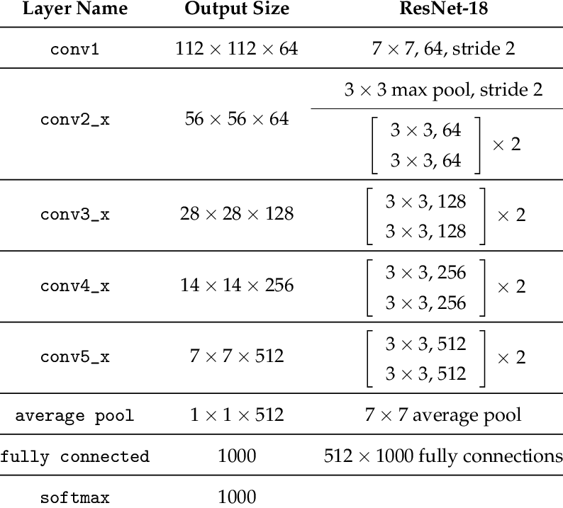
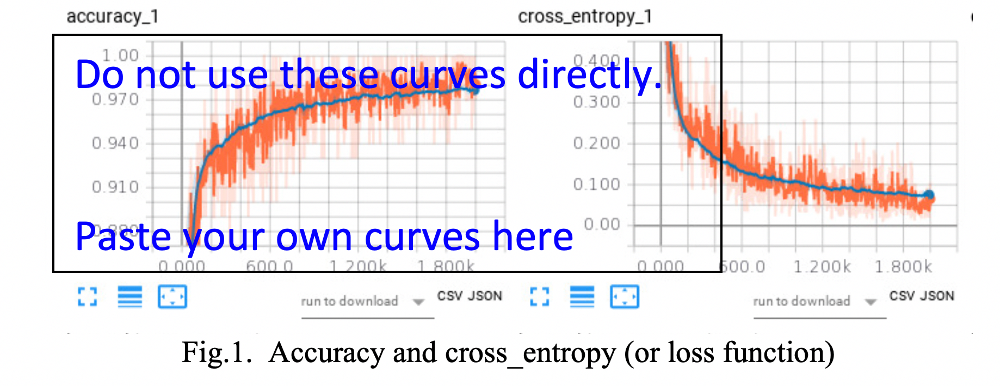
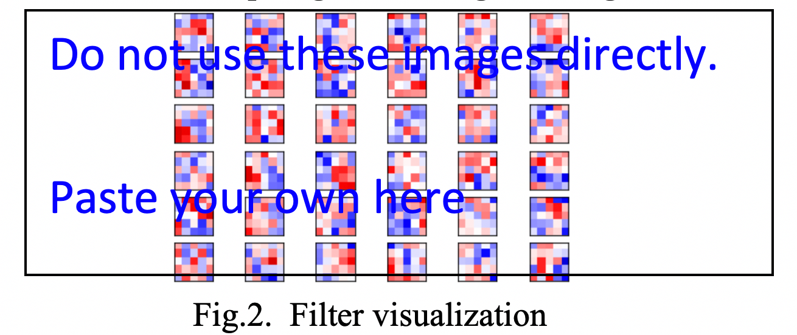

# Assignment 1 CNN for image recognition (20p)

## Goal

To familiarize yourself with which you have learned for building a new CNN model. 

## Due Date

**October** **25, 2019 at 08:00am**. 

Note that it is a **DEADLINE**. You will grade as zero if you return your report and code after the deadline unless you have good reasons and let me know in advance. 

## Steps

### 1 Dataset download

1.1 Please use the training set and testing set of CIFAR-10 dataset: https://www.cs.toronto.edu/~kriz/cifar.html


1.2 Downloading CIFAR-10 dataset following this link: https://pytorch.org/tutorials/beginner/blitz/cifar10_tutorial.html


1.3 If you have no GPU at hand, please do it like this:

```python
device = torch.device("cuda:0" if torch.cuda.is_available() else "cpu")
model = model.to(device)
```

If you have more questions, please contact our **TA (Qian Ren)**.

*Table 1 your own ResNet model*



### 2 Create your own ResNet work shown in Table 1 (19p)

2.1 Table 1 is an 18-layer ResNet model. Each block “conv_i-x” has a “shortcut connection”. For details, see the Fig. 2 in the paper https://arxiv.org/pdf/1512.03385.pdf

2.2 Create this model in Table 1 (**8p**) 

2.3 The code in this link might help you https://pytorch.org/docs/stable/_modules/torchvision/models/resnet.html

2.4 Use the downloaded training dataset (see Section 1) to train your created model

2.5 Report the final accuracy (10,000 steps) of training and testing for the CIFAR-10 dataset (see Section 1.1) (**2x1=2p**). 
    **Note**: For training in task 2, 10,000 iterations are good. 1,000 iterations are fine if your computation power is limited. However, 100 steps are the **minimum**. Try to train **more iterations** to observe the variations of loss function, cross entropy, accuracy for training dataset and testing set. It would help you to tune the model, parameters for your future task.
***(Sum: 10p)***

2.6 Visualize the learning progress (e.g., tensorboardX in Pytorch). Please take a picture for the visualized curves in tensorboardX or visdom in Pytorch then paste them here




- accuracy (**1p**) and 

- cross_entropy (or loss function) (**1p**) as shown in Fig. 1. 
 ***(Sum: 12p)***

2.7 Filter visualization 

- Visualization the 64 filters in the layer 'Conv1'(Layer-1 in Table 2) after retraining the whole model by 10,000 steps (**3p**) and show them in your report. Some examples are shown in Fig. 2.
**Note**: For training in task 2.7, 10,000 iterations are good. 1,000 iterations are fine if your computation power is limited. However, 100 steps are the **minimum**.
 ***(Sum: 15p)***
- You might refer to this link : https://github.com/grishasergei/conviz



2.8 Feature mapping visualization 

- Visualize the feature maps of the layer 'Conv1'(Layer-1 in Table 2) and also the last layer in the block Conv5_x (**2*2=4p**)

- Some example figures can be found in Figure 2 of this paper: https://arxiv.org/pdf/1311.2901.pdf

- I want both 
  - the reconstructed patterns from the validation set that cause high activations in a given feature map (**2p**). 
  - the corresponding image patches for each feature map (**2p**).

- Some example code can be found here: https://github.com/kvfrans/feature-visualization

    https://github.com/utkuozbulak/pytorch-cnn-visualizations

- Document for these code:

    http://kvfrans.com/visualizing-features-from-a-convolutional-neural-network/

***(Sum: 19p)***

### 3. Feedback (1p)
* Time your spend for this assignment, i.e., how many hours? (**0.1p**)
* Comments for this course? (**0.3p**)
* Comments for this assignment? (**0.3p**)
* Suggestion for the following lectures? (**0.3p**)


**(Sum:  20p)**


## Report
* **Code** for Task 2. The code should be based on **Pytorch(Version 1.3 is required)** platform and using python language.
* The **results**, curves and filter visualization are suggested to include in report.
* **Feedback**
* Your code should be **bug free**. You would get **zero point** if there are bugs and we can not run your code to get the results.
## Note
* If you have questions about the project, please contact with (**Qian Ren**) as early as possible, **two days or more** before the deadline are preferred
## How to submit 
* Send an email (renq2019@pku.edu.cn), with the title **AI_homework_1_X_Y**:
    * where AI is the abbreviation for artificial intelligence;
    * X is your name in Chinese; 
    * Y is your studentID;
    * We are sorry that we do not provide file server for you to upload your homework.
    * If you have any questions about this course or assignment, please use a separate email. Do not ask any questions in this assignment-return email.
* Pack your code AND report in one package, using the file name **AI_homework_1_X_Y** instead of AI or something like that. 
    * Report is not suggested to put in the email.
    * You are suggested to pack report with your code in one package with the title: Report_AI_homework_1_X_Y.
    * Report is suggested to be in PDF and in **ENGLISH**.
    * The default package might be in “.zip” format. If not, please show your format and how we can unpack it (i.e., software).   
* **Attach your package** which includes the code and report you have created. 
* My email: (**renq2019 @pku.edu.cn**)
## Honor Code
* The honor code applies to all work turned in for this course. 
* You must write and debug your own code. 
* In particular, all code and documentation should be entirely your own work. You may consult with other students about high-level design strategies related to programming assignments, but you may not copy code or use the structure or organization of another student’s program.
* If you use any code or functions found from the internet, please tell us the reference link and how do you use it. **Direct code copy from the internet would be considered violation of this policy**.
* **If we find there are two returned assignments same in large proportional code, both of the assignments would be considered violation of this policy**
